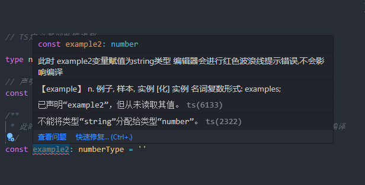
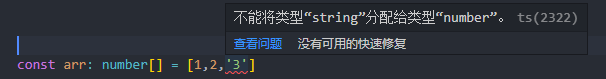
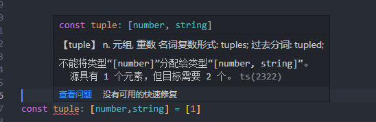
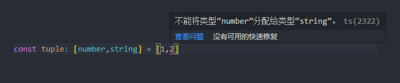
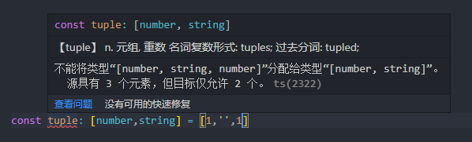
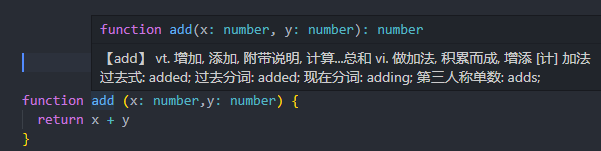
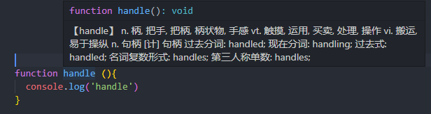

# basics typeScript

# 定义基础数据类型

```JavaScript


/**
 * type 关键字用于声明类型
 * 定义一个number类型
*/

  type numberType = number

/**
 * 声明一个变量,在变量名后添加:号 :后定义类型
 * 此时 声明了一个example1变量 数据类型定义为number
*/
  const example1: numberType = 1

/**
 * 此时 example2变量赋值为string类型 编辑器会进行红色波浪线提示错误,不会影响代码运行
 * 想要解决红色波浪线错误 只需给变量赋值为定义的数据类型即可
 */

  const example2: numberType = ''


```



`上述所说如有理解 剩下的几种数据类型简简单单啦 `

## String 类型

```JavaScript

type stringType = ''
const exampleStr: stringType = 'hello word'

```

## Boolean 类型

```JavaScript

type booleanType = boolean
const examleBoolean1: booleanType = true
const examleBoolean2: booleanType = false

```

有时一些简单的类型,每次都通过关键字 type 去声明类型,有些过于麻烦了
通过 type 关键字定义数据类型可以有复用效果

在变量名后,直接定义类型,不在通过 type 关键字去定义类型
简化声明类型 👇

## Number 类型

```JavaScript
const examleNum: number = 1
```

## undefined 和 null 类型

```JavaScript

/**
 * undefined 类型
*/
const u: undefined = undefined

/**
 * null 类型
*/
const n: null = null

```

## any、unknown 和 void 类型

### any 类型

any 表示可以是任何数据类型
一般用于不清楚用什么类型时,使用 any
不建议使用 any,如都使用 any 那使用 TS 意义是什么?
`不要把typeScript变成anyScript`

```JavaScript

  const exampleAny1: any = ''
  const exampleAny2: any = 1
  const exampleAny3: any = true
  const exampleAny4: any = null
  const exampleAny5: any = undefined

```

以上定义的变量都合法,编辑器并不会飘红

### unknown 类型

当不知道一个类型具体是什么时,该怎么办?
可以使用`unknown`
unknown 类型代表任何类型,它的定义和 any 定义很像,但它是一个安全类型,`使用 unknown 赋任何值都不合法`。

```JavaScript

function handle (param: unknown){
  return param % 2
}

```

不知道 param 的类型,使用运算符会导致报错

### void 类型

表示不会返回任何值,函数默认返回 void 类型

```JavaScript

function handle ():void {
  console.log('Hello World')
}

```

## 数组类型

定义 number 类型数组,数组里的数据只能是 number 类型

```JavaScript
const arr: number[] = [1,2,3,'4']
```



## 元组类型

元组类型允许表示一个已知元素数量和类型的数组，各元素的类型不必相同

数组第零项只能是 number 类型,第一项只能是 string 类型
赋错数据类型、越界、长度不等于 2 会报错

```JavaScript

const tuple: [number,string] = [1,'str']

```

赋错数据类型

长度不相等

越界


## never 类型

never 表示用于不存在值的类型

定义 example 永远都是空数组,如果赋有数据数组或、其他类型都是不合法的

```JavaScript

const example: never[] = []

```

不合法

```JavaScript

const example2: never[] = [1]

```

## 函数类型

定义函数类型需要定义输入参数类型和输出类型

输出类型也可以忽略,因为 TS 能够根据返回语句自动推断出返回值类型

此时 TS 会根据返回语句自动推断出返回值类型

```JavaScript

function add (x: number,y: number) {
  return x + y
}

add(1,1)

```



函数没有明确返回值，默认返回 Void 类型

```JavaScript

function handle (){
  console.log('handle')
}

```



函数表达式写法

```JavaScript

const fn = (): number =>{
  return 1
}

```

?表示可选参数,可选参数必须放在最后不然会报错

```JavaScript

function add (x: number, y: number, z?: number){
  if(typeof z === 'number') return x + y +z
 return x + y
}

add(1,2)
add(1,2,3)

```

默认参数

```JavaScript

const defaultParam = (x: number, y: number = 2023): number =>{

  return x + y
}

defaultParam(2022)
```
